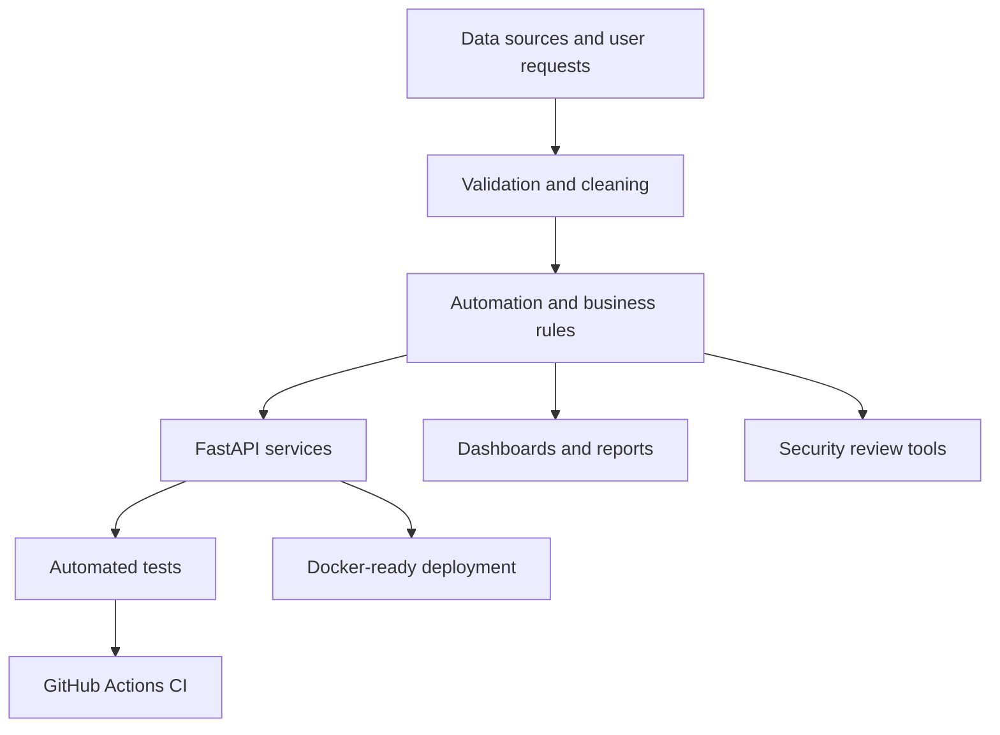

# AI, Data and Automation Portfolio

This repository contains practical projects that reflect my experience in software engineering, workflow automation, data operations, cloud security, cybersecurity, API development, and business process improvement.

I built the projects around operational problems I have worked with: validating payroll records, matching buyers with sellers, reviewing IAM exports, monitoring security logs, preparing dashboards, moving data through ETL processes, handling routine support requests, and exposing business workflows through a tested API.


## Featured project

### [Operations Automation API](operations-api/)

A FastAPI service for creating, tracking, filtering, updating, and deleting operational jobs. It includes request validation, automated tests, Docker support, Swagger documentation, an architecture diagram, and continuous integration with GitHub Actions.

[](https://render.com/deploy?repo=https://github.com/Usmandalhat01/ai-data-automation-portfolio)

Deployment details and verification steps are available in [DEPLOYMENT.md](DEPLOYMENT.md).

## Project directory

| Project | What it demonstrates |
|---|---|
| [Operations Automation API](operations-api/) | FastAPI, REST APIs, Pydantic, pytest, Docker and CI |
| [Payroll Data Validator](payroll-data-validator/) | Python, pandas, data cleaning, validation and reporting |
| [Buyer-Seller Matcher](buyer-seller-matcher/) | Business rules, scoring logic, CSV processing and automation |
| [AWS IAM Audit Helper](aws-iam-audit-helper/) | Cloud security review, MFA checks, access-key age and privilege flags |
| [Operations Dashboard](operations-dashboard/) | Streamlit, KPI reporting, filtering and operational insights |
| [Cybersecurity Log Analyzer](cybersecurity-log-analyzer/) | Log parsing, event classification, severity tracking and reporting |
| [Customer Support Assistant](customer-support-assistant/) | Support automation, FAQ matching, ticket classification and escalation |
| [Simple ETL Pipeline](simple-etl-pipeline/) | Extract, transform, validate, load, logging and reusable data workflows |

## Main tools

- Python and pandas
- FastAPI and REST API design
- SQL-style data processing
- Streamlit dashboards
- pytest and GitHub Actions
- Docker
- CSV and JSON
- Data validation and reporting
- Workflow automation
- AWS IAM security concepts
- Git and GitHub

## Portfolio architecture



## Running a project

Each folder has its own README and sample data. Most command-line projects follow the same pattern:

```bash
python -m venv .venv
source .venv/bin/activate   # Windows: .venv\Scripts\activate
pip install -r requirements.txt
python app.py
```

The FastAPI project uses:

```bash
cd operations-api
pip install -r requirements.txt
uvicorn app.main:app --reload
```

## Notes

The sample data is fictional and included only for demonstration. The projects are intentionally straightforward so the logic can be reviewed, tested, and extended easily.

## Author

**Usman Ibrahim Dalhatu**  
GitHub: [Usmandalhat01](https://github.com/Usmandalhat01)
