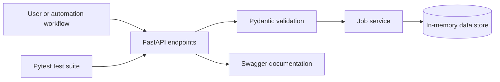

# Operations Automation API

A compact FastAPI service for recording and tracking operational jobs. I built it to demonstrate how a simple internal business tool can expose clean endpoints, validate incoming data, support status updates, and remain easy to test and deploy.

## Features

- Health-check endpoint
- Create, list, filter, update, and delete jobs
- Pydantic request validation
- Clear HTTP status codes
- Automated tests with pytest
- Docker support
- Interactive API documentation through Swagger UI

## Run locally

```bash
cd operations-api
python -m venv .venv
source .venv/bin/activate  # Windows: .venv\Scripts\activate
pip install -r requirements.txt
uvicorn app.main:app --reload
```

Open `http://127.0.0.1:8000/docs` to test the API.

## Run tests

```bash
pytest -q
```

## Run with Docker

```bash
docker build -t operations-api .
docker run -p 8000:8000 operations-api
```

## Architecture



## Production improvements

For a production deployment, I would replace the in-memory store with PostgreSQL, add authentication, structured logging, database migrations, rate limiting, and environment-based configuration.
